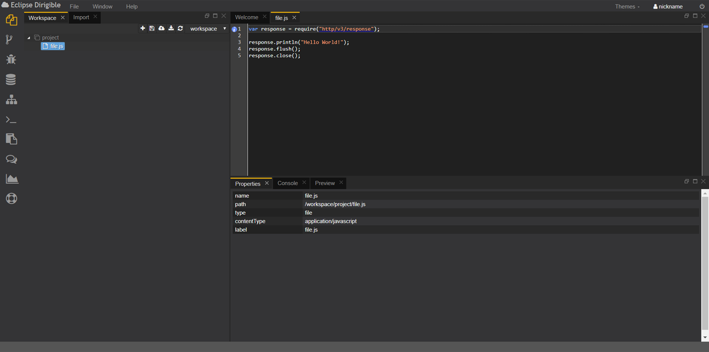

# Workbench Perspective
This is the place where the user develops the dynamic applications. This perspective contains all views and editors that may help in the overall implementation, from domain models via services to the user interface. The Workbench perspective consists of several views: **Workspace**, **Import**, **Properties**, **Console** and **Preview**, as well as editors suitable for any file type. In other words, the minimal toolset for file management, preview and editing operations. The main view opened by default in this perspective is the Workspace explorer, a standard view on the projects in your workspace.

##The Workbench perspective consists of:

###*Workspace view*

Workspace is the developer's place where he / she creates and manages the files of his application and projects. Each project can contain multiple folders and files. A single user can have multiple workspaces, containing different set of projects. In Version 3 of Dirigible there is a new  new template-based project and artifacts scaffolding generators features. The projects file organization is now non-normative and entirely up-to the preferences of the users.  The IDE supports multiple editors registered for different file types. The Workspace explorer displays a standard view on the projects in your workspace. It shows the folder structure along with the files. 

There is a context menu assigned to the project node from where the user can create a new file, folder or artifact.

###*Import view*

The Import section allows the user to upload a file with any extension or a *.zip file, containing one or more projects in the selected workspace. The view includes a bar that shows the file upload process in the workspace. The user can manage and switch between several workspaces through the Workspace menu.

###*Properties view*

In the properties section the user can see the name, path, type, and the content of a file chosen by him.

###*Console view*

The console is a major debugging tool. It shows the output of the code that the user is executing. 

###*Preview view*

The Preview section shows the result of the selected file.  It refreshes automatically when an event occurs in the workspace.

