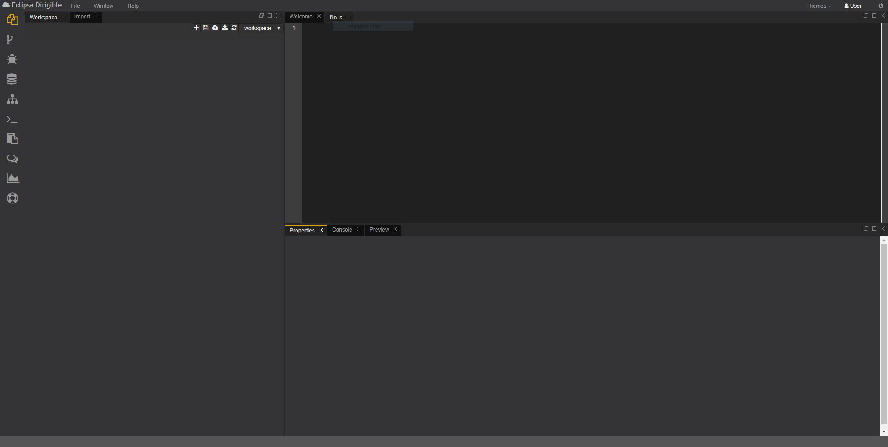
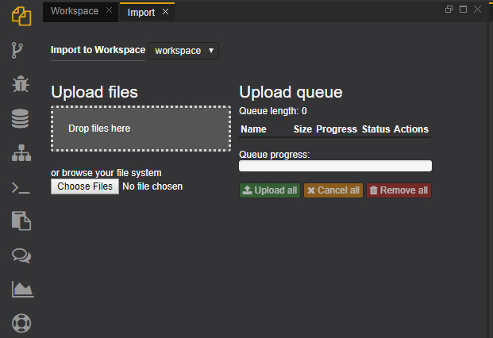

# Workbench perspective in Eclipse Dirigible

**Eclipse Dirigible** is an Integrated Development Environment as a Service (IDEaaS) for dynamic applications. It provides both development tools and runtime environment.

From the end user's perspective (developer), Dirigible runs directly in the browser, therefore does not require any downloads or installations, making it very convenient for developing dynamic apps.

One of the key perspectives in the IDE is **Workbench**. This is the place where the user develops the dynamic applications. This perspective contains all views and editors that may help in the overall implementation, from domain models via services to the user interface.

More specifically, it comprises the following views:

 - [Workspace](#Workspace)
 - [Import](#Import)
 - [Properties](#Properties)
 - [Console](#Console)
 - [Preview](#Preview)

It also includes the editors registered for each type. In other words, the minimal toolset for file management, preview and editing operations is contained in this perspective.

## Workspace

The main view opened by default in this perspective is the Workspace explorer, a standard view on the projects in your *workspace*.

The  **Workspace**  is the developer’s place where he/she creates and manages the application artifacts. The first-level citizens of the  _workspace_  are the  _projects_. Each project can contain multiple folders and files (artifacts).

A single user can have multiple workspaces, containing different set of projects.

In this view, the developer can:

 - create a new project or workspace
 
 
 - Save All
 - Publish All
 - Export All
 - Refresh project
 - Change workspace
 

## Import

The Import view allows the developer to import a file to the Workspace and include it in the project.

The developer needs to select to which workspace the file is to be uploaded.
Then the file can be uploaded via drag-and-drop or by browsing the local file system. On the right, an upload queue which gives information about the status of files being uploaded is displayed.
## Properties
The Properties view allows the developer to inspect the properties of each file included in the project (e.g. name, path, contentType, etc.)

This is a read-only view.
## Console
The Console view is a major debugging tool. It displays the output of the code that is being executed.

This is another read-only view.

## Preview
The Preview view displays the result of executing the selected file. It refreshes automatically during Workspace change events e.g. Save.

## References

 - [Eclipse Dirigible Online Help](http://www.dirigible.io/help/)
