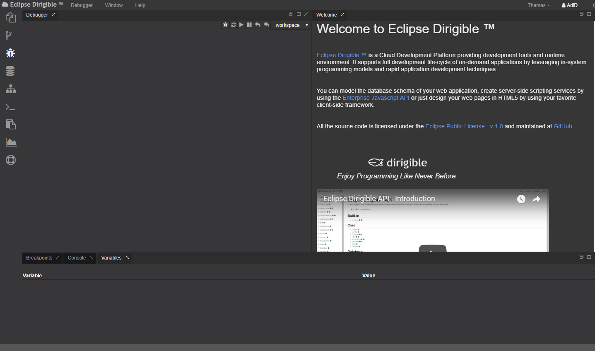
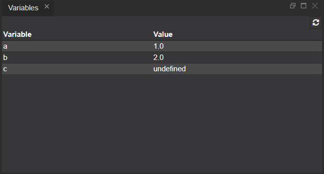

# Debugger Perspective in Eclipse Dirigible 
   In this documentation you will learn how to use the Debugger in Eclipse Dirigible.

The front-facing Web IDE component is a collection of plugins for project management, source code editing, modeling, SCM integration, database management and many more. The Debugger perspective enables you to monitor the execution of your code, stop it, restart it or set breakpoints, and change values in memory.
# Content
The Debugger perspective has five views:
   -	Debugger
   -	Variables
   -	Breakpoints
   -	Console
   -	Preview
# Debugger
The window of the Debugger looks like.

# Variables view
 The Variables view displays the defined values of the variables when the code is executed.
You can see them during the debugging process.

# Breakpoints view
The breakpoint view shows you the breakpoints that you have created and enables you to follow them during debugging.
The first column of the view displays the path to the file in the repository and the second one - the row where the breakpoint is put.

# Console view
The console view shows the output of the code you are executing. It is very important for debugging purposes.

#Preview view
The Preview view displays the result of executing the selected file. It refreshes automatically during Workspace change events e.g. Save.

