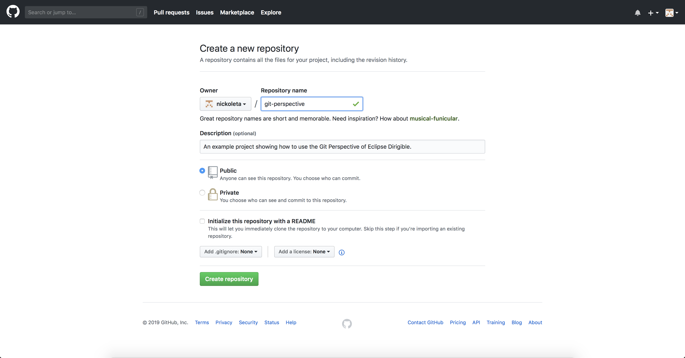
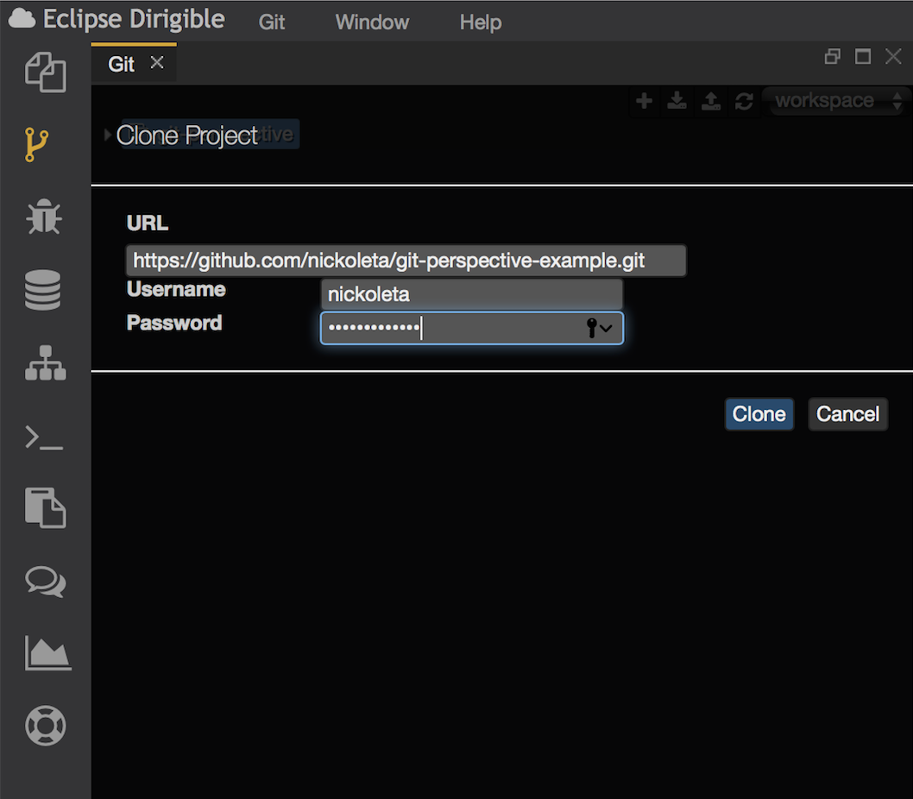
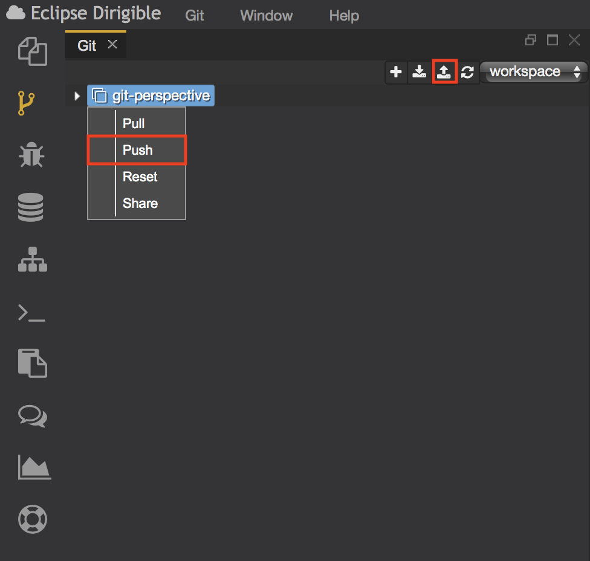

# Eclipse Dirigible - Git Perspective

The Git perspective aims at presenting a simplified interface for the most common git operations. It is built from tools that support Git client operations. 
The Git perspective is comprised of Git, Console views and Workspace menu. It enables the users to perform simple git operations such as cloning a repository to a workspace, pulling changes, and pushing commits.

## Prerequisites
Start Eclipse Dirigible locally on your PC or open the Online version.

## Description
Git Perspective consists of three main parts.
### Git
Git is a version control system for tracking changes. As a SCM, it is aimed at speed, data integrity and support for software development workflows.
### Workspace menu
The Workspace is the place where the developer creates projects. It is also an environment that allows the 'communication' between the local and remote files.
### Console View
The Console view is a tool that gives us information about the actions we’ve made.

## Functionalities
To show the main functionalities of Git Perspective we will create a sample repository. For those of you who are not familiar with Git, please start with reading the [Git Documentation](https://git-scm.com/doc).
### Clone a repository
First create a remote repository. 

To clone the remote repository, select the ‘+’ button from the menu. It will open a popup window where you have to write the URL to the remote repository as well as your credentials.

### Pull changes
To pull you remote changes, right click on the project and select the “pull” option. You can also select to pull all projects using the ‘pull’ button from Git Perspective menu. 

### Push commits
To push your local changes to the remote branch, right click on the project and select ‘push’.
You can also push all projects’ changes by selecting the ‘push’ button from the Git Perspective menu.

Then go back to your Git account and all changes will be published remotely. 
